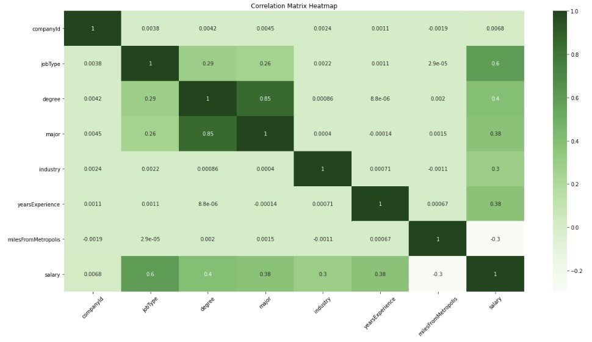

# SalaryPredictionProject

  

  

It wouldn't be the worst thing in the world if we didn't have a salary cap. - Jerry Jones

The jupyter notebook in this repo is procedural, it contains explaination of all the steps and respective findings with the use of markdowns. This readme will give a summary of the steps and results of the project.

### PROBLEM DEFINITION
An organization's ability to maintain a fair and balanced pay structure in line with internal and external (industry) factors is vital for it's success and employee retention KPI. Coming up with the right salary offer to candidates during recruitment process is crucial in attracting good talents to an organization.

The goal of this portfolio is predicting salaries for a new set of job posting with reliable accuracy by examining a set of job postings with salaries.

#### Assigned Task
Examine a set of job postings with salaries and then predict salaries for a new set of job postings with models.

#### Supplied Data
- train_features.csv: Each row represents metadata for an individual job posting.
The “jobId” column represents a unique identifier for the job posting. The remaining columns describe features of the job posting.
- train_salaries.csv: Each row associates a “jobId” with a “salary”.
- test_features.csv: Similar to train_features.csv, each row represents metadata for an individual job posting.
The first row of each file contains headers for the columns. Keep in mind that the metadata and salary data may contain errors.

#### Deliverables
- Your test_salaries.csv file containing the salary predictions for the test data set (.zip, .7z, or .gz compression is allowed).
- The code that you wrote to solve the problem (.zip, .7z, or .gz compression is allowed).

### DATA DISCOVERY

#### - Obtain data
1. Import Libraries and set up directory where python interpreter access code files
2. Load Data 
3. Examine and Get Insights on Data
   - The 3 input files each have 1 million rows. 
   - Merged train data (train_features + train_target) has 1 million rows and 9 columns
   - Test Feature data has 1 million rows and 8 columns
   - Datasets have mixed data types (objects and integers)
4. Clean data
   - No duplicates in data
   - Datasets do not have null values
   - Data inspected for invalid data i.e. presence of outliers. Outliers then reviewed and dropped data (5 rows) below the lower bounds for suspected ouliers. 
5. Explore data
   - Summarize Numerical and Categorical variables. Confirmed jobId is a unique identifier for the job posting.
   - Review Correlation between each feature and the target variable using plots and feature counts as required.
   - Identify correlation between all features respectively. Snapshot of produced heatmap below. 
   

  

 

6. Set baseline outcomes
   - Using the JobType feature which has highest correlation to Salary. Average of salary for subcategories of job type to is used to establish a baseline for models of   prediction using mse as metric. Baseline Mean Squared error of 963.925 was established. The next step is to improve the MSE values.
7. Hypothesize solutions
   - A suite of regression supervised learning algorithms are selected to improve the MSE metric with the training data.
     - Linear Regression - simple to implement and easier to interpret the output coefficients.
     - Random Forest Regressor - improves the accuracy by reducing overfitting problem and the variance in decision trees.
     - GradientBoostingRegressor - Typically produces best predictions because it can optimize on different loss functions and provides several hyperparameter tuning options that make the function fit very flexible.
     - Stacking Regressor - Combination method to improve the mse of the best of the 3 models.
   - Also Summary Statistics were computed for each group based on groupings of the top highly correlated features to generate new features. 
   - Importance of these new features will be evaluated later in the project.
### MODEL DEVELOPMENT 
1. Feature Engineering
   - Transform categorical features into individual binary feature using the one hot encoding approach.
   - Split transformed data into train and test data for use during model creation and evaluation process.
2. Create models
3. Test models
4. Select best model
