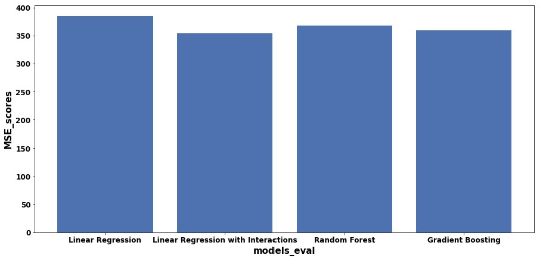

# SalaryPredictionProject

  

  

It wouldn't be the worst thing in the world if we didn't have a salary cap. - Jerry Jones

The jupyter notebook in this repo is procedural, it contains explanation of all the steps and respective findings with the use of markdowns. This readme will give a summary of the steps and results of the project.

### PROBLEM DEFINITION
An organization's ability to maintain a fair and balanced pay structure in line with internal and external (industry) factors is vital for it's success and employee retention KPI. Coming up with the right salary offer to candidates during recruitment process is crucial in attracting good talents to an organization.

The goal of this portfolio is predicting salaries for a new set of job posting with reliable accuracy by examining a set of job postings with salaries.

#### Assigned Task
Examine a set of job postings with salaries and then predict salaries for a new set of job postings with models.

#### Supplied Data
- train_features.csv: Each row represents metadata for an individual job posting.
The “jobId” column represents a unique identifier for the job posting. The remaining columns describe features of the job posting.
- train_salaries.csv: Each row associates a “jobId” with a “salary”.
- test_features.csv: Similar to train_features.csv, each row represents metadata for an individual job posting.
The first row of each file contains headers for the columns. Keep in mind that the metadata and salary data may contain errors.

#### Deliverables
- Your test_salaries.csv file containing the salary predictions for the test data set (.zip, .7z, or .gz compression is allowed).
- The code that you wrote to solve the problem (.zip, .7z, or .gz compression is allowed).

### DATA DISCOVERY

#### - Obtain data
1. Import Libraries and set up directory where python interpreter access code files
2. Load Data 
3. Examine and Get Insights on Data
   - The 3 input files each have 1 million rows. 
   - Merged train data (train_features + train_target) has 1 million rows and 9 columns
   - Test Feature data has 1 million rows and 8 columns
   - Datasets have mixed data types (objects and integers)
4. Clean data
   - No duplicates in data
   - Datasets do not have null values
   - Data inspected for invalid data i.e. presence of outliers. Outliers then reviewed and dropped 5 rows of data with invalid Salary data i.e. Zero Salary)
5. Explore data
   - Summarize Numerical and Categorical variables. Confirmed jobId is a unique identifier for the job posting.
   - Review Correlation between each feature and the target variable using plots and feature counts as required.
   - Identify correlation between all features respectively by using label encoding categorical features with the mean salary. Snapshot of produced heatmap below. 
   

  

 

6. Set baseline outcomes
   - Using the JobType feature which has highest correlation to Salary. Average of salary for subcategories of job type to is used to establish a baseline for models of   prediction using mse as metric. Baseline Mean Squared error of 963.925 was established. The next step is to improve the MSE values.
7. Hypothesize solutions
   - A suite of regression supervised learning algorithms are selected to improve the MSE metric with the training data.
     - Linear Regression - simple to implement and easier to interpret the output coefficients.
     - Linear Regression with Interaction variables - explore the significance of relationships between various features.
     - Random Forest Regressor - improves the accuracy by reducing overfitting problem and the variance in decision trees.
     - GradientBoostingRegressor - Typically produces best predictions because it can optimize on different loss functions and provides several hyperparameter tuning options that make the function fit very flexible.
### MODEL DEVELOPMENT 
1. Feature Engineering
   - Transform categorical features into individual binary feature using the one hot encoding approach.
   - Split transformed data into train and test data for use during model creation and evaluation process.
2. Create models
   - All models are created in this section
   - Hypertuning of models were done using Google Colab for the random forest and Gradient Boost Model was tuned in the notebook.
3. Evaluate Models 
   - Each model was evaluated using optimal parameters derived.
4. Test models
   - Models were tested using the split test data from the transformed merged data.

  

 

Model | Score
------------ | -------------
BENCHMARK – LinearRegression | MSE: ~384.6
LinearRegression (with interaction) | MSE: ~354.7
RandomForestRegressor | MSE: ~368.3
BEST - GradientBoostingRegressor | MSE: ~ 359.9 

5. Select best model
   - LinearRegression (with interaction) model has the lowest MSE, hence it is selected for the salary prediction with the test dataset
### MODEL DEPLOYMENT
1. Train best model selected on the entire training data.
2. Score the Test Dataset
   - Encode data to match the shape of the train dataset 
   - Deploy the model on the test data to predict salaries
   - Combine the original test data with the predicted salaries and export to csv as a deliverable
3. Feature Importance
   - Define function
   - Derive feature importance

  

  

4. Summarize the predicted 
   - Visualize predicted salary data
   - Compare the predicted salaries with the training data salary. See "Salary Prediction Results Summary.pdf" in the repo for presentation of summary and conclusions based on the model.

  

  

A day’s pay for a day’s work is more than adequate when both the work and the pay are appreciated as much as they are expected. - Cullen Hightower
